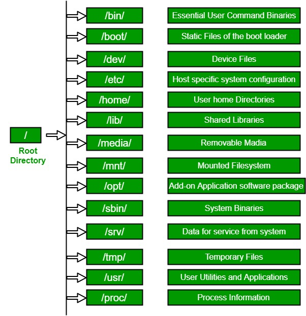

# Shell

## What is Shell?

### Definitions

- Shells are command interpreters.
  - They are applications that provide users with the ability to give commands to their operating system interactively, or to execute batches of commands quickly.
  - In no way are they required for the execution of programs;
  - they are merely a layer between system function calls and the user.
- Think of a shell as a way for you to speak to your system.
  - Your system doesn't need it for most of its work, but it is an excellent interface between you and what your system can offer.
  - It allows you to perform basic math, run basic tests and execute applications.
  - More importantly, it allows you to combine these operations and connect applications to each other to perform complex and automated tasks.
- BASH is not your operating system.
  - It is not your window manager.
  - It is not your terminal (but it oftens runs inside your terminal).
  - It does not control your mouse or keyboard.
  - It does not configure your system, activate your screensaver, or open your files when you double-click them.
  - It is generally not involved in launching applications from your window manager or desktop environment.
  - It's important to understand that BASH is only an interface for you to execute statements (using BASH syntax), either at the interactive BASH prompt or via BASH scripts.

### Concepts: Terminal, Console, Shell and Command line

|    <br>Sr. No.    |    <br>Terminal                                                                                                                                                                       |    <br>Console                                                                                                                                                                                               |    <br>Shell                                                                                                                                                                                             |    <br>Command-line                                                                                                                                                                                                                                |
|-------------------|---------------------------------------------------------------------------------------------------------------------------------------------------------------------------------------|--------------------------------------------------------------------------------------------------------------------------------------------------------------------------------------------------------------|----------------------------------------------------------------------------------------------------------------------------------------------------------------------------------------------------------|----------------------------------------------------------------------------------------------------------------------------------------------------------------------------------------------------------------------------------------------------|
|    <br>1          |    <br>A   terminal is a text input and output environment.                                                                                                                           |    <br>A   physical terminal is referred to as a console.                                                                                                                                                    |    <br>The   shell is a command-line interpreter.                                                                                                                                                        |    <br>A   command line, also known as a command prompt, is a type of interface.                                                                                                                                                                   |
|    <br>2          |    <br>A   terminal is a wrapper program that runs a shell and allows us to enter   commands.                                                                                         |    <br>The   console is a type of terminal. It is a window in which your text-mode   programs are active.                                                                                                    |    <br>The   shell is the program that actually processes commands and outputs results.                                                                                                                  |    <br>A   command-line interface is any type of interface that is used to enter   (textual) commands. One of these is the terminal, but some programs have   their own command-line interfaces.                                                   |
|    <br>3          |    <br>The   terminal is a program that displays a graphical interface and allows you to   interact with the shell.                                                                   |    <br>The   console consisted of a single keyboard and monitor plugged into a dedicated   serial console port on a computer for low-level direct communication with the   operating system.                 |    <br>A   shell is a user interface for   accessing the services of an operating   system.                                                                                                              |    <br>A   command-line interface (CLI) is a computer program that processes commands in   the form of lines of text. The user typically interacts with the shell via a   command-line interface (CLI).                                            |
|    <br>4          |    <br>The   term terminal can also refer to a device that allows users to interact with   computers, typically via a keyboard and display.                                           |    <br>A   console is a physical terminal that is the primary terminal that is directly   connected to a machine. The console is recognized by the operating system as   a (kernel-implemented) terminal.    |    <br>A   shell is a primary interface that users see when they log in, and its primary function is to launch other programs.                                                                           |    <br>A   command line is an interface that allows a user to type a command (which is   expressed as a sequence of characters — typically a command name followed by   some parameters) and then press the Return key to execute that command.    |
|    <br>5          |    <br>    <br>Some types of terminal emulators include:<br>    <br>     <br> - Command prompt<br>     <br> - guake<br>     <br> - gnome-terminal<br>     <br> - terminator           |    <br>For   example, Famicom, Xbox, PlayStation, Nintendo Switch, Wii, and Wii U, etc.   are all examples of consoles.                                                                                      |    <br>    <br>Some examples of shells are:<br>    <br>     <br> - Bash, fish, zsh, ksh, sh,         tsch<br>     <br> - Power Shell, pwsh<br>     <br> - cmd, yori, 4dos,         command.com           |    <br>    <br>Some examples of Command-line interface are:<br>    <br>     <br> - Microsoft Windows,<br>     <br> - DOS Shell, and<br>     <br> - Mouse Systems Power Panel.                                                                      |

### Concepts: OS, Kernal and Shell

- Kernel: core of the operating system (Inner layer)
- Shell: outer layer of OS
- 
- 

## Questions

- why it is named Shell?
  - <https://en.wikipedia.org/wiki/Shell_(computing>)
  - It is named a shell because it is the outermost layer around the operating system
- What are the different types of shells?
  - GUI shell
  - CLI shell: bash, zsh, fish, etc.
- Do different shells have different commands?
- TTY demystified
  - <http://www.linusakesson.net/programming/tty/index.php>
  - Tele type Writer
- Fundamental differences between shells
- Login shell and non-login shell, interactive shell and non-interactive shell
  |    <br>                   |    <br>login                                                                                                  |    <br>Non-login                                                                                                                                     |
  |---------------------------|---------------------------------------------------------------------------------------------------------------|------------------------------------------------------------------------------------------------------------------------------------------------------|
  |    <br>interactive        |    <br>SSH<br>   <br>Open a new   terminal (Ctrl T)<br>   <br>    <br>New login shells -> Ctrl        T       |    <br>Open a new shell   from login shell<br>   <br>Within login shell   -> Parent shell & sub shells<br>   <br>    <br>$bash, $zsh, $fish, …       |
  |    <br>Non-interactive    |    <br>Extremely rare,   unlikely to encounter                                                                |    <br>Run a script                                                                                                                                  |

### Login shell

- Purpose of a login shell?
  - The purpose of a login shell isn’t to handle login, it’s to behave appropriately as the first shell in a login session:
    - mainly, that means processing startup files which should only be processed once per login session,
    - and protecting the login session from unwanted interaction with certain system features (job suspension in particular).
  - The login shells' responsibility is to start the non-login shell and to make sure that your environment variables are set so as to ensure that you can get all the default parameters needed at start-up.

- How do you know if you are in a login shell?
  - $echo $0
    - hyphen (-) as prefix
  - -zsh, -bash

- To summarize:
  - The profile files are for interactive login shells.
    - /etc/profile
    - ~/.bash_profile
  - The RC files are for interactive non-login shells.
    - /etc/bashrc
    - ~/.bashrc
  - Files in /etc directory are executed first and then the files in the home directory.
    - System wide: /etc
    - User wide: ~/
  - The non-login, interactive shells benefit from both profile and RC files.

### check your shells

```shell
# show default shell
$echo $SHELL
# show all shells
$cat /etc/shells
# process status, current shell
$ps
```

## Linux Commands

### Types of Commands

- Program executables
- Alias
- Shell reserved words
- Shell functions
- Built-in commands (built into the shell, thus you cannot find them within the file system)

### Linux dir structures

- 


## References
